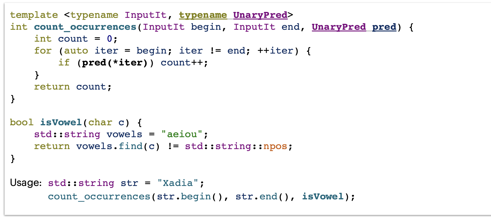
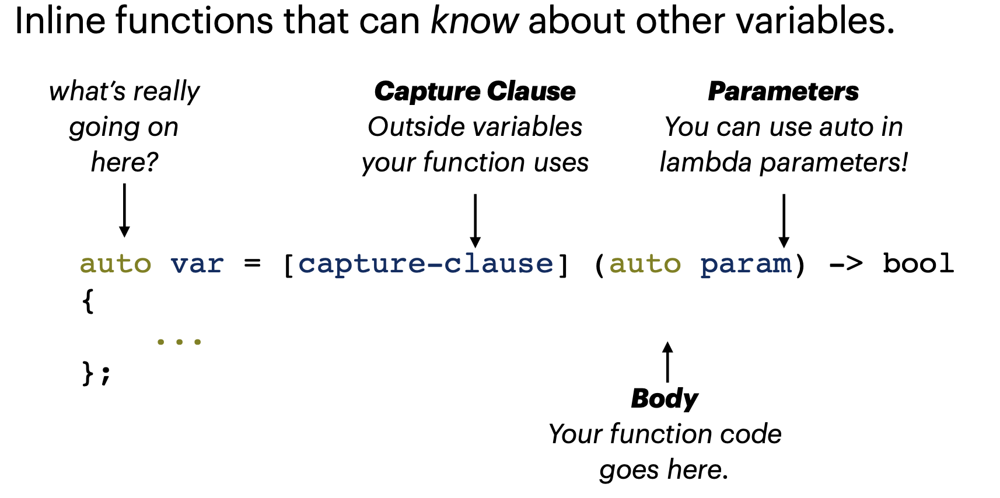

# Function Pointer and Lambdas



`isVowel` is a pointer, just like Node`*` or char `*`. It is called `function pointer`. It can be treated like a variable. 

Transfer informatino by parameters maybe not so flexiable, there is another way to do this.

## Lambdas



```cpp
[]// captures nothing
[limit]// captures lower by value
[&limit]// captures lower by reference
[&limit, upper]// captures lower by reference, higher by value
[&, limit]// captures everything except lower by reference
[&]// captures everything by reference
[=]// captures everything by value

auto printNum = [] (int n) { std::cout << n << std::endl; };
printNum(5); // 5
int limit = 5;
auto isMoreThan = [limit] (int n) { return n > limit; };
isMoreThan(6); // true
limit = 7;
isMoreThan(6);
int upper = 10;
auto setUpper = [&upper] () { upper = 6; };
```

- Lambdas are cheap, but copying them may not be.

- **Use lambdas when you need a short function, or one with read/write access to local variables!**

- Use function pointers for longer logic and for overloading.

- We use “auto” because type is figured out in compile time.

## Functor and Closure

仿函数functor，就是使一个类的使用看上去象一个函数。其实现就是类中实现一个operator，这个类就有了类似函数的行为，就是一个仿函数类了。

提出其的想法是不仅能让其像一个函数一样被调用，还可以访问更多的一些数据。

Lambdas is an easy way to create functor. When the function combined with status, it becomes a `closure`.

We can use `std::function<return_type(para_type,...,para_type)> func` to rule `functor, lambdas and function pointer`. It can hold any callable entity.

```cpp
 
void functionPointer (int arg) { int num = 0;
num += arg; }
// or
int num = 0;
auto lambda = [&num] (int arg) { num += arg; };
lambda(5); // num = 5;
std::function<void(int)> func = lambda;
```

## STL Algorithms

`#include <algorithm>`, it cotains sort · reverse · min_element · max_element · binary_search · stable_partition · find · find_if · count_if · copy · transform · insert · for_each · etc.!


