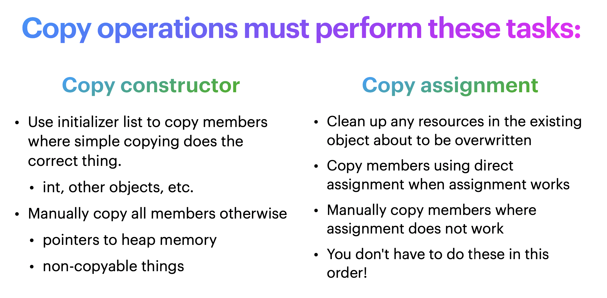

# Special Member Function

## Special Member Functions(SMFs)

These functions are generated only when they're called.(without any explicitly define by ourselves)

```cpp
class Widget{
    public: 
        Widget(); // default constructor
        Widget(const Widget& w); //copy constructor It will make a member-wise deep copy of an object
        Widget& operator = (const Widget& w); // copy assignment operator 
        // sim to copy constructor, you can use w1=w2 to set one object equal to another
        ~Widget(); // destructor
        Widget(Widget&& rhs); // move constructor
        Widget& operator = (Widget&& rhs); //move assignment operator
}
```

**All SMFs are public and inline fuctions(will replaced by the compiler)**

```cpp
using std::vector;
vector<int> func(vector<int> vec0) {
vector<int> vec1; // default constructor
vector<int> vec2(3); // Not SMFs, a constructor with a parameter
vector<int> vec3{3}; // Not SMFs, initialize list
vector<int> vec4(); // A function declare
vector<int> vec5(vec2); // Copy constructor
vector<int> vec{};  // Default constructor
vector<int> vec{vec3 + vec4};  // Copy constructor
vector<int> vec8 = vec4; // Copy constructor
vec8 = vec2; // Copy assignment
return vec8; // Copy constructor: copy vec8 to location outside of func
} // Deconstructor
```

**Constructor's trick**

Initializer list: 

```cpp
template <typename T> vector<T>::vector<T>() :
_size(0), _capacity(kInitialSize), _elems(new T[kInitialSize]) 
{ }
```

**Prefer to use initialize list:**

* Faster! 

*  

* Can use it for any constructor, even if it has parameters. 

## Default SMFs aren't always sufficient!

The just work by mannully**copying each member variables!** This causes many problems!

for example:

```cpp
// Default copy constructor
template <typename T>
vector<T>::vector<T>(const vector::vector<T>& other) :
  _size(other._size),
  _capacity(other._capacity),
  _elems(other._elems) { }

// used here 
vector<int> operator + (const vector<int>& vec, int elem) { 
    vector<int> copy = vec;
    copy += element; // assume that the += operator is defined return copy;
}
```

**The copy and vec will point to the same dram!!!**


In many cases, **copying is not just copy member variables!!!**

Thanks god, we can change this suitation by overwriting them:

```cpp
// fix the copy constructor
template <typename T>
vector<T>::vector<T>(const vector::vector<T>& other) :
  _size(other._size),
  _capacity(other._capacity),
  _elems(new T [other._capacity]) {
      std::copy(other._elems,
                other.elems+other._size, _elems);
  }

// fix the copy assignment
 
template <typename T>
vector<T>& vector<T>::operator = (const vector<T>& other) {
    if (&other == this) // avoid self-reassignment
        return *this; 
    _size = other._size; 
    _capacity = other._capacity; 
    delete[] _elems; // avoid memory leak
    _elems = new T[other._capacity]; 
    std::copy(other._elems, 
    other._elems + other._size, _elems);
    return *this; // return a reference to the vector itself.
}
```

****

#### Summary: steps to follow for an assignment operator



1. Check for self-assignment

2. Make sure to free existing members if applicable

3. Copy assign every automatically assignable member

4. Manually copy all other members

5. Return a reference to *this 


## =delete & =default

The default copy assignment/operators can be very helpful, but sometimes we wan to **block them**, what shoul we do?

**Explicitly delete the copy member functions**

```cpp
class PasswordManager { 
public:
    PasswordManager();
    PasswordManager(const PasswordManager& pm);
    ~PasswordManager();
    // other methods ...
    PasswordManager(const PasswordManager& rhs) = delete; 
    PasswordManager& operator = (const PasswordManager& rhs) = delete;
private:
    // other important members ...
}
```

**What if you want to keep SMFs if you're overwriting them?**

**Using `=default`!**

```cpp
class PasswordManager { 
public:
    PasswordManager();
    PasswordManager(const PasswordManager& pm)=default;
    ~PasswordManager();
    // other methods ...
    PasswordManager(const PasswordManager& rhs) = delete; 
    PasswordManager& operator = (const PasswordManager& rhs) = delete;
private:
    // other important members ...
}
```

## When should we write SMFs?

**Rule of 0: If the default operations work, then don't define your own.**

## When shoule you write your own SMFs?

* **When the default ones generated by the compiler won't work**

* **Most common reason: there's a resource that our class uses that's not stored inside of our class**: dynamically allocate memory

## Rule of 3

**If you explicitly define a copy constructor, copy assignment operator, or destructor, you should define all three!**

But why?

* If you're explicitly writing your own copy operation, you're controlling certain resources manually

* You should then manage the creation, use, and releasing of those resources!


## This four enough?

There have `default constructor, copy constructor, copy assignment, deconstructor`. 

Look this suitation:

We are going to copy our StringTable to another, whose reference is given to us and we have no use for our StringTable afterwards.

```cpp
class StringTable { 
public:
    StringTable() {}
    StringTable(const StringTable& st) {}
    // functions for insertion, erasure, lookup, etc., // but no move/dtor functionality
    // ...
private:
    std::map<int, std::string> values;
}
```

The copy constructor will be very slow!!!

## Move constructors and Move assignment operators

*std::move operations in SMFs*(c++11)

```cpp
class Widget{
    public: 
        Widget(); // default constructor
        Widget(const Widget& w); //copy constructor It will make a member-wise deep copy of an object
        Widget& operator = (const Widget& w); // copy assignment operator 
        // sim to copy constructor, you can use w1=w2 to set one object equal to another
        ~Widget(); // destructor
        Widget(Widget&& rhs); // move constructor
        Widget& operator = (Widget&& rhs); //move assignment operator
}
```
Move constructor/assignment will perform "memberwise moves"

Defining a copy constructor do not affect the generation of a default copy assignment, vice versa.

While define a move assignment will **prevent** generation of a move constructor, vice versa.

*if the move assignment operator needs to be re-implemented, there'd likely be a problem with the move constructor*

**Move operations are generated for classes only if these things are true:**

1. No copy operations are declared in the class

2. No move operations are declared in the class

3. No destructor is defined in the clsaa

You can get all of these by using `=default`

