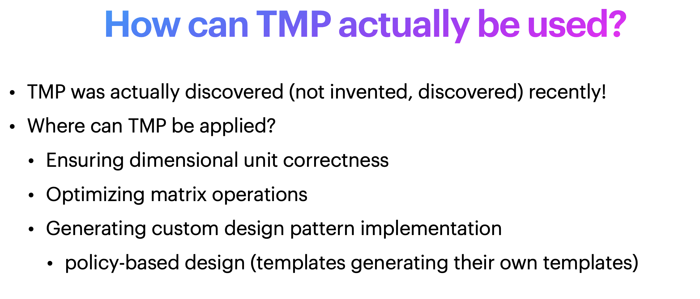

# Template functions

reusable, unique code with no duplication.

```cpp
template <typename type>
type myMin(type a, type b){
	return a < b ? a : b;
}
cout << myMin<int>(3,4)<<endl;
```
Its parameters can be provided or **deduced**.

```cpp
template <typename type>
auto myMin(type a, type b){
	return a < b ? a : b;
}
cout << myMin(3.2,4)<<endl;
```

**Deduction Rules:**

- IF the template function's parameters are regular, pass by value.

1. Ignore `&`

2. After `1.`, ignore `const` too.

- IF the template function's parameters are references or pointers.

1. Ignore `&`

2. Match the type of parameters to inputted arguments.

3. Add `const` after.

**Template functions are not complied until used by the code.**

After compilation, the compiled code looks like you had written each instantiated version of the function yourself.

# Template MetaProgramming(TMP)

TMP: run code during compile time. It can:

* make compiled code packages smaller.

* speed up code when it's actually running.


