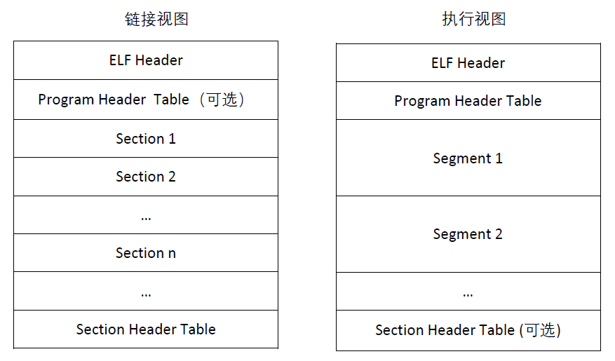
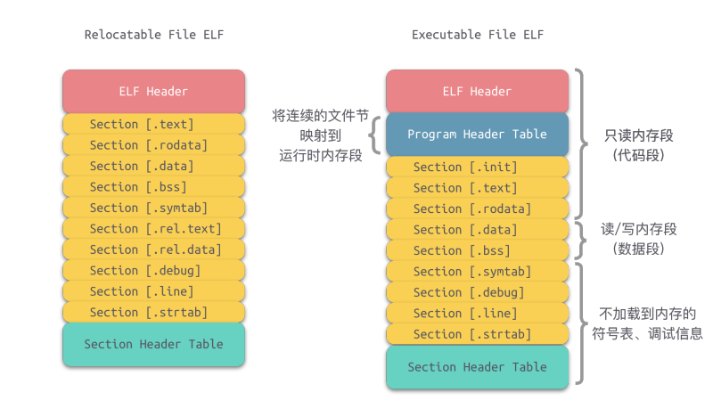
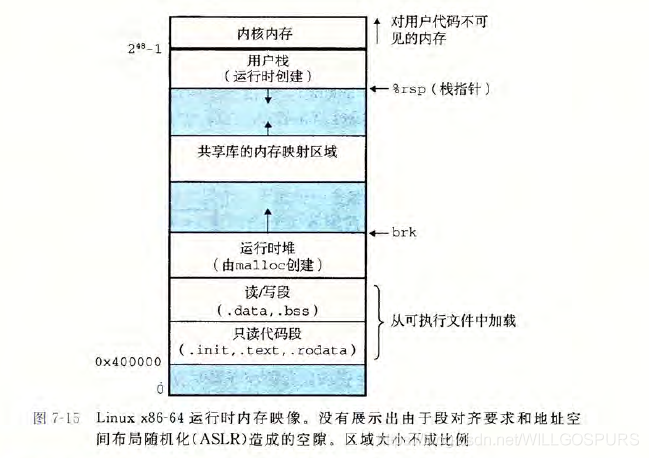

# 链接

## 静态链接

链接器必须完成两个任务:

1. 符号解析. 每个符号对应一个函数/全局变量/静态变量, 目的是将每个符号引用正好和一个符号定义关联起来.

2. 重定位. 在进行符号解析后, 修改所有对这些符号的引用, 让其指向这个内存地址. 

## 目标文件

有三种形式: 可重定位目标文件; 可执行目标文件; 共享目标文件.

我们主要学习一下可重定位目标文件.



ELF头以一个16bytes的序列开始, 该序列描述了文件的系统的字的大小和字节顺序. 剩下的信息包括: elf头大小, 目标文件类型, 及其类型, 节头部表的文件偏移, 节头部表中的条目的大小和数量. **不同节的位置和大小是由节头部表描述的, 每个节都有一个固定大小的条目**

`.txt`: 已编译程序的机器代码

`.rodata`: 只读数据

`.data`: 已初始化的全局和静态c变量

`.bss`: 未初始化的全局和静态c变量

`.symtab`: 符号表, 存放程序中定义和引用的函数和全局变量的信息. 并不包含局部变量信息

`.rel.text`: 一个`.txt`节中位置的列表, 当链接器将该文件与其他文件组合时需要进行修改.

`.rel.data`: 被模块引用/定义的所有全局变量的重定位信息. 如果初始值是一个全局变量地址/外部函数地址, 都要修改

`.debug`: 调试符号表, 程序中定义的局部变量和类型定义, 程序中定义和引用的全局变量, 以及原始的C源文件. `-g`选项才会生成该表. 

`.line`: c源程序行号和`.txt`中机器指令的映射. `-g`得到

`.strtab`: 包括`.symtab` `.debug`中的符号表, 以及节头部的节名称. 

每个可重定位目标文件m都有一个符号表`.symtab`, 包含三种不同的符号:

1. 由m 定义并能被其他模块引用的全局符号(无`static`的全局函数, 变量)

2. 由其他模块定义并能被模块m引用的全局符号(外部符号)

3. 只被模块定义和引用的局部符号(`static`)

对于本地过程变量的管理在栈中. 对`static`变量, 编译器在`.data/.bss`中为每一个定义都分配空间. 并在符号表中创建一个有唯一名字的本地链接器符号.

符号表每个条目的格式:

```cpp
typedef struct{
    int name; //.strtab的字节偏移
    char type:4, //function or data
         binding:4; // local or global
    char reserved; // Unused
    short section; //Section header index 
    long value; //section offset or abs addr
    long size; // object size in bytes
}Elf64_Symbol;
```
section字段有三个伪节(在节头部表中无定义): ABS(不该被重定位的符号), UNDEF(还未定义的符号, 在本模块引用但在其他模块定义的符号), COMMON(还未被分配位置的未初始化的数据目标)

**COMMON: 未初始化的全局变量; .bss: 未初始化的静态变量, 初始化为0的全局/静态变量**

## 符号解析

链接器解析符号引用的方式是将每个引用和它输入的可重定位目标文件的符号表中的一个确定的符号定义关联起来. 

对于引用定义在同一模块的局部符号的引用进行符号解析很简单: 编译器只允许每个局部符号有一个定义. 静态局部变量也会有本地链接器符号, 编译器确保它们拥有唯一名字. 

但全局符号的解析很困难:

1. 编译器遇到本模块未定义函数, 会默认为由其他模块定义, 交给linker处理

2. 多个目标文件可能会定义相同名称的全局符号. 

下面是linux处理多重定义全局符号的策略:

编译时, 每个全局符号有强(函数/已定义全局变量)弱(未定义全局变量)之分

规则1: 不允许有多个同名的强符号

规则2: 如果有一个强符号和多个弱符号同名, 选择强符号.

规则3: 如果有多个弱符号同名, 从中任选一个.

例子请看课表P472

这也就回到了前面所说的伪节中的`COMMON`和`.bss`:

如果编译器遇到了一个弱全局符号x, 他并不知道其他模块是否也定义了x, 如果是:它无法预测linker使用哪一个. 因此将其定义为`COMMON`,将决定权留给linker. 如果是一个强符号, 那么编译器就可以将其放入`.bss`中。

*****

**与静态库进行链接**

所有的编译系统都可以将所有相关的目标模块打包成为一个单独的文件: 静态库. 可以作为链接器的输入, 当链接器构造一个输出的可执行文件时, 只复制库里应被应用程序引用的目标模块.

以archive的文件格式存储, .a. 是一组连接起来的可重定位目标文件的集合.

在进行链接时, 常是从左到右进行扫描的, 一般将链接文件放在最后面. 且如果库不是互相独立的, 必须对其进行排序, 使每个引用后都有相应的定义.

## 重定位

一旦linker完成了符号解析, 就可以确定输入模块中代码节和数据节的具体大小, 可以重定位.[这是一篇比较详细的blog](https://segmentfault.com/a/1190000016433947)

两步:

1. 重定位节和符号定义: 将所有类型的节合并为同一类型的新的聚合节。然后linker将运行时地址赋给新的聚合节, 赋给输入模块定义的每个节, 以及赋给输入模块定义的每个符号. 这样**每条指令和全局变量就有唯一的运行时内存地址了**

2. 重定位节中的符号引用: 修改代码节和数据节中对每个符号的引用, 使得其指向正确的运行时地址. 依赖.rel.data/text字段.

重定位条目格式:

```cpp
typedef struct{
    long offset; //需要被修改的引用的节偏移
    long type:32.   //如何修改
         symbol:32; //被修改引用应指向的符号
    long addend; //常数, 一些类型的重定位要使用它对被修改引用的值做偏移调整。
}
```
elf定义了32种重定位类型.

## 可执行目标文件



elf头描述文件的总体格式, 还包括程序的入口点, 即第一条指令的地址. `.init`节定义了一个小函数, 程序初始化代码进行调用. elf可执行文件连续的片被映射到连续的内存段, 可以很容易地移入内存. 

要运行可执行文件需要调用加载器, 将程序复制到内存并开始运行。

加载器运行时, 创建类似下图的内存映像: 



在程序头表的引导下, 加载器将可执行文件的chunk复制到代码段和数据段. 接下来, 加载器跳转到程序的入口点, 即_start函数地址(定义在系统目标文件ctrl.o中), 尝试调用系统启动函数__libc_start_main函数, 定义在libc.so中. 它初始化环境, 调用用户的main函数,处理其返回值。

## 动态链接共享库

静态库的问题在于:

1. 和所有软件一样, 需要定期维护

2. 对于很常用的函数也必须每个进程的文本段都留一个, 浪费内存资源

共享库可以解决上述问题: 是一个目标模块，在运行/加载时可以加载到任意的内存地址, 并和一个在内存中的程序链接起来. 这个过程叫动态链接.(**也就是说可执行文件中并不包含函数的执行代码, 而只是添加了函数调用信息.**)

如何共享:

1. 任何一个文件系统中对于一个库只有一个.so文件. 

2. 在内存中, 一个共享库的.text段可以被不同的进程共享.

**装载时动态链接**

当加载器运行可执行文件时, 会发现文件包含一个`.interp`字段, 包含动态链接器的名称. 加载运行该动态链接器, 然后动态链接器通过下面的重定位完成链接任务:

1. 重定位libc.so的文本和数据到某个内存段

2. 重定位程序中所有对由libc.so定义的符号的引用

3. 最后 dynamic linker将控制传递给应用。

**运行时动态链接**

在编译之前并不知道将会调用哪些DLL函数，完全是在运行过程中根据需要决定应调用哪个函数，将其加载到内存中（只加载调用的函数进内存），并标识内存地址，其他程序也可以使用该程序，并用LoadLibrary和GetProcAddress动态获得DLL函数的入口地址。

****

那么多个进程是如何共享程序的一个副本呢？这就要使用到**位置无关代码(PIC)了!!!**

可以加载且无需重定位的代码叫位置无关代码. 在同一目标文件中的符号引用并不需要特殊处理, 直接pc相对寻址即可; 对于全局变量进行`PIC`引用则需要下述操作:

### PIC数据引用

因为任意目标模块的**数据段和代码段的距离总是不变的**. 因此**代码段中任何指令和数据段中任何变量之间的距离都是一个运行时常量**.

在数据段开始时创建一个**全局偏移量表(GOT)**, 每个被该过程引用的全局数据目标都会有一个表项, 编译器也会为其生成一个重定位目录. 在加载时, 动态链接器会重定位GOT的每个条目, 使其包含目标的绝对地址. 

### PIC函数调用

现在假设程序调用一个由共享库定义的函数, 编译器无法预测该函数的运行时地址, 因为共享模块可能被加载到任意位置. 怎么办？

我们能够想到的方法是让编译器给他生成一条重定位记录, 在程序加载时由dlinker进行解析.

**但这种方式不是PIC, 毕竟需要linker修改调用代码段**, GNU编译系统提出了**lazy binding, 将过程地址的绑定延迟到第一次调用该过程！**

动机是: 对于一个常见的共享库, 一个典型的application往往只会调用其中很小的一部分, 把函数地址解析放在其实际被调用的地方可以避免动态链接器在加载时进行许多不必要的重定位. 

使用两个数据结构**GOT和PLT(过程链接表, 在代码段)**

详细过程见P492