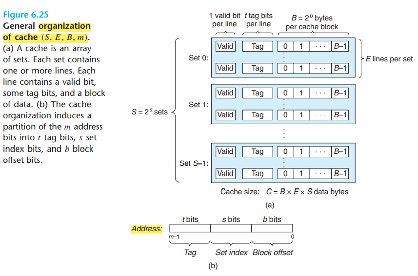

# 存储器层次结构

## RAM

分为: SRAM和DRAM, 即静态和动态存储器。 SRAM作为高速缓存, 可用于片上和片下; 有电值就不会变

DRAM用作主存, 对干扰很敏感, 必须刷新. 

### 传统 DRAM

内部的位由**d超单元(sipercell)**组成. **每个超单元都由w个dram单元组成**。一个dxw的dram总共存储了dw位信息, **超单元被组织成为一个r行c列**的方阵.

每个DRAM芯片被连接到`memory controller`的电路. 电路一次可以传送w位到每个dram芯片或一次从芯片传出w位。

为了读超单元(i,j)的内容, 内存控制器需要传入`RAS(i), CAS(j)`。芯片的操作是在收到`RAS`后将一行移入内部缓冲区, 在收到`CAS`后从缓冲区复制出超单元的w位。

设计成二维阵列而非一维数组的原因是降低芯片地址引脚数量。缺点是必须分两步发送地址, 时间延长。

### 内存模块...

课本P402

## 磁盘存储

磁盘由盘片构成, 每个盘片有两面, 每个面由一组磁道组成, 每个磁道被分为一组扇区, 每个扇区含有等量的数据位(512bytes).扇区间由一些间隙分隔开, 间隙中一般不存储数据位. 

常用 `柱面`来描述多个盘片驱动器的构造, 柱面是所有盘片表面上到主轴中心的距离相等的磁道的集合。

磁盘容量 = 字节数/扇区 * 平均扇区数/磁道 *  磁道数/表面 * 表面数/盘片 * 盘片数/磁盘

磁盘的访问时间由: **寻道时间, 旋转时间, 传送时间组成**. 主要时间在于寻道和旋转。一般寻道和旋转延迟大致相同, 所以将寻道时间x2是估计磁盘访问时间的简单方式。

磁盘中有一个`磁盘控制器`负责逻辑块号和物理磁盘扇区之间的映射。一个逻辑块号:(盘面, 磁道, 扇区).
**实现负载均衡, 避免过度读写**

DMA(直接内存访问): 电脑内部的硬件子系统，可以独立地直接读写系统内存，而不需中央处理器介入处理。

# 局部性

`局部性原理`: 计算机程序倾向于引用邻近于其他最近使用过的数据项的数据项, 或者最近引用过的数据项. 分为

`时间局部性`: 被引用过一次的内存位置很可能在不久的将来再被多次引用.

`空间局部性`: 如果一个内存位置被引用了一次, 那么程序很可能在不久的将来引用附近的一个内存位置.

## cache

cache的组织结构

高速缓存被分为有S=2^s个高速缓存组, 每组有E个高速缓存行, 每行由B=2^b字节的数据块组成.

地址被分为三个部分

**为什么用中间位作组索引？**

如果用高位做索引，那么一些连续的内存块就会被映射到相同的高速缓存块, 容易出现抖动。

### 直接映射高速缓存

每组只有一行(E=1)的高速缓存

### 组相联高速缓存

直接映射cache中造成冲突不命中的问题源于每个组只有一行, 当1< E < C/B的高速缓存通常称为E路组相联高速缓存。

### 全相联高速缓存

地址中没有组索引位, 因为只有一个组.只有标记和块偏移。

全相联高速缓存必须并行地搜索很多相匹配的标记, 费用较高, 常用于小的高速缓存: TLB

## 写cache

### 写命中

分为直写: 将w的高速缓存块写回紧接着的低一层中. 缺点: 占用总线流量. 

写回: 尽可能推迟更新, 只有当替换算法要驱逐这个更新过的块后, 才将其写入低一层中. 可减少总线流量, 缺点是增加了复杂性, cache必须为每个高速缓存行维护一位`脏位`.

### 写不命中

写分配(write alloc): 加载低一层中的块到高速缓存中, 然后更新这个高速缓存块. 

非写分配(not write alloc): 避开cache, 直接写到低一层中.

**直写和非写分配通常一起出现, 写回和写分配通常一起出现**

## cache参数对性能影响

### cache容量

较大的cache会提高命中率, 但可能会增加命中时间

### 块大小

较大的块可以使程序的空间局部性更优, 但对于给定大小的cache, 块越大意味着cache行越少, 会损害时间局部性比空间局部性更好的程序的命中率. 较大的块对于不命中处罚也有负面影响: 传送时间长。

### 相联度

较高的相联度可以减少抖动, 但会带来较高的成本. 且需要更多的标记位, 需要额外的LRU状态位和控制逻辑, 且会增加命中时间和未命中惩罚(牺牲块选择策略复杂)

实际上是命中时间和未命中处罚的trade-off

### 写策略

直写cache比较容易实现, 且能使用独立于cache的write buffer, 且读不命中开销小, 不会触发写内存.

写回cache引起的传送少, 允许更多的带宽用于执行DMA的I/O设备, 此外, 越往层底结构下面走, 传送时间越长, 减少传送次数就越重要. **一般cache越往下层, 越可能使用写回而非直写**

