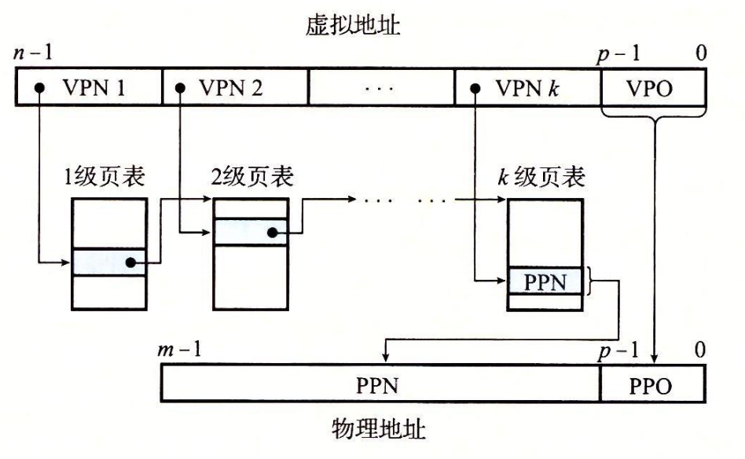

# 虚拟内存

虚拟内存提供的三种能力:

1. 将主存看作存储在磁盘上的地址空间的高速缓存, 在主存中只保存活动区域, 根据需要在磁盘和主存间传递数据。

2. 为每个进程提供一致的地址空间, 简化内存管理

3. 保护每个进程的地址空间不被其他进程破坏

虚拟内存被分割位固定大小的`虚拟页`, 物理内存也被分割为`物理页(页帧)`

虚拟页面集合包括三部分: 

1. 未分配的: VM系统还未分配的页。

2. 缓存的: 当前已缓存在物理内存的已分配页

3. 未缓存的: 未缓存在物理内存的已分配页

由于页不命中的处罚很大, 所以虚拟`页面大小往往很大`, 且被组织为`全相联的`, 且因为写磁盘的访问时间很长, 所以一般采用`写回策略`

## 页表

同cache一样, 虚拟内存系统必须有某种方法确定一个虚拟页是否缓存在DRAM的某个地方, 且必须知道存放在哪个物理页/磁盘位置。

该功能由os, MMU和存放在物理内存中的页表共同提供. **页表将虚拟页映射到物理页**

页表本身就是一个PTE(page table entry)数组, 虚拟地址空间每个页都在页表里一个固定偏移处有一个PTE。

一个PTE由一个**有效位**和一个**nbits的地址字段**组成。如果设置了有效位, 那么地址字段就表示DRAM中相应的物理页的起始位置; 若未设置有效位, 那么如果是空地址就还未分配/ 否则地址指向虚拟页在磁盘上的起始位置。

## 缺页

若发现虚拟页并未被缓存, 那么会触发缺页异常: 选择一个牺牲页, 将磁盘中对应页与其交换。

虚拟内存工作良好的原因还是在**局部性**: 程序将趋于在一个较小的活动页面集合上工作

## 虚拟内存带来的bonus

* 作为内存管理工具

先下结论: **虚拟内存简化了内存管理**

在os中其实每一个进程都有一个独立的页表, 即一个独立的虚拟地址空间。

**简化链接**: 独立的地址空间可以允许每个进程的内存映像使用基本相同的格式.(之前一直看到的内存映像)。 这样的一致性简化了链接器的设计, 允许链接器生成完全链接的可执行文件,这些可执行文件是独立于物理内存中代码和数据的最终位置的。

**简化加载**: 要把目标文件的.text和.data段加载到一个新进程中, loader只需要为代码和数据段分配虚拟页, 然后将其标记为无效的, 将页表条目指向目标文件中的位置即可。

**简化共享**: 将不同进程中适当的虚拟页映射到相同的物理页面即可共享代码。

**简化内存分配**: 虚拟内存为用户进程提供了一个简单的额外内存分配机制: os分配适当数量的虚拟内存页面并将其映射到物理内存中, 且物理内存中也不需要连续分配。

* 作为内存保护工具

现代os不允许用户进程修改只读代码段和内核内容, 也不允许访问其他进程的私有内存/任何与其他进程共享的虚拟页面。

可以在PTE表上添加一些额外的许可位来控制对虚拟页面的访问。若违反这些许可条件, CPU就会触发一般保护故障`"segmentation fault"`

## 地址翻译

CPU中有一个指向当前页表的寄存器`页表基址寄存器(PTBR)`, n位的虚拟地址包括两个部分: p位的虚拟页面偏移`vpo`, n-p位的虚拟页号`vpn`. 

MMU通过`vpn`来选择适当的PTE, 将页表条目中的物理页号和`vpo`串联起来, 得到物理地址.

**命中流程**:

1. 处理器生成一个虚拟地址, 将其传入MMU

2. MMU生成PTE地址, 从cache/dram中得到

3. cache/dram向MMU返回PTE表项

4. MMU构造物理地址, 将其传送给cache/dram

5. cache/dram 将请求数据传送给处理器

**缺页流程**:

1. 处理器生成一个虚拟地址, 将其传入MMU

2. MMU生成PTE地址, 从cache/dram中得到

3. cache/dram向MMU返回PTE表项

4. PTE有效位为0, MMU触发**异常**, 传递cpu的控制到缺页异常处理程序

5. 缺页异常处理程序确定出物理内存中的牺牲页, 若是脏页, 则将其换出到disk

6. 缺页异常程序调入新的页面, 更新PTE

7. cpu重新执行该指令, cpu重新将虚拟地址传递给MMU, 重复命中时的步骤

## 结合高速缓存和虚拟内存

用虚拟地址还是物理地址去访问高速缓存呢？

使用物理地址, 多个进程同时共享存储块很容易, 且无需处理保护问题(权限检查是地址翻译里已有的). 大多系统使用物理寻址。

这里有一篇很棒的博客, 体系结构课上也引用这篇[文章](https://zhuanlan.zhihu.com/p/107096130)

## TLB加速地址翻译

可以看到, 每次翻译虚拟地址, MMU都必须查阅PTE. 最差情况下会要求从内存多取一次; 在L1cache中也会浪费一两个周期. 

很多系统都会尽量消除这样的开销, 在**MMU中包括一个关于PTE的cache, 称为TLB(翻译后备缓冲器)**

TLB是一个小的虚拟寻址缓存, 每一行都保存着一个由单个PTE组成的块. 

tlb中用于组索引和行匹配的字段是从虚拟页号中提取出来的。

## 多级页表

多级页表可以节约内存: 1. 如果一级页表一个PTE是空的, 那么后面的二级/三级...页表就不会存在 2. 只有一级页表是必须在内存中的, 其他页表可以调入调出. 

地址翻译的过程如下图:

