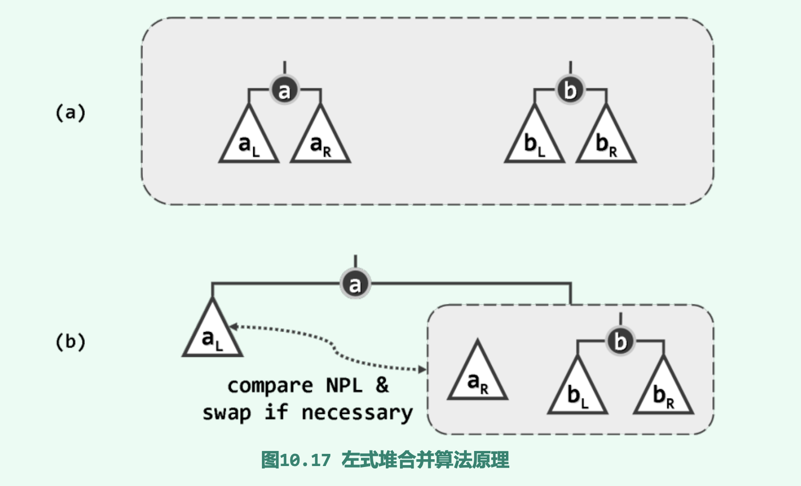

# 优先级队列

此前的搜索树/词典等结构, 其中每一个存储的对象都可以作为查找和访问的对象, 因此搜索树需要在所有元素间定义并维护一个`full order`关系; 词典在对象数值与对应秩之间建立某种关联, 从而隐式地定义一个全序关系.

而优先级队列的操作对象仅限为`当前的全局极值者`, 这种根据对象间优先级进行访问的方式称为`循优先级访问`

全局极值隐含了`所有元素可互相比较`的性质, 但优先级队列不会维持这个全序关系, 而是维护一个偏序关系.

## ADT

优先级队列中的数据项称为`entry`, 与优先级相对应的数据属性称为`key`. 对于优先级队列, 必须以比较器的形式兑现对应的优先级关系, 但维护一个全序关系的代价很高昂, 优先级队列作为一个单独的数据结构出现也是为了通过使用一个偏序关系来控制计算成本.

### 应用实例: HUFFMAN TREE

每次寻找优先级最高(数值最小的值)两棵树, delete 后合并为一棵, 加入森林. 因为PQ的ADT操作均可在O(logn)时间内完成, 因此, 算法的时间复杂度为O(nlogn), 相比之前遍历的算法O(n^2)有所提升.

## 堆

基于列表/向量实现PQ,  无法保证insert()与delMax()操作的高效性. 原因在于:**其对优先级理解过于机械, 维护了一个全序关系.** 优先级队列 **只关心全局优先级最高的词条, 次高者, 第三高者不予考虑.**借助堆(heap)维护一个偏序关系足以:

### 完全二叉堆

逻辑结构与完全二叉树相同, 就优先级来说, 堆顶外的每个节点都不大于其父节点, 即`堆序性`.

根据堆顶元素的优先级可以将其分为`大顶堆`和`小顶堆`.

若按层次遍历的次序, 将堆中各节点组成一个向量, 那么各节点的编码与向量的秩一一对应.

```cpp
i(lchild(v)) = 2 * i(v) +1
i(rchild(v)) = 2 * i(v) +2
i(parent(v)) = (i(v)-1)/2 //向下取整
```

### 插入元素

算法分为两个步骤: 1. 将新词条接至向量末尾。  2. 对该词条实施上滤操作

设新插入为节点`e`, 其父亲p的秩i(p) =(i(e) -1/2) 下取整

> 若e ≤ p, 堆序性已满足, 插入操作完成
> 反之若 e > p, 则令e与p交换位置, 如此往复, 直至满足上一条条件

可知, 上滤次数不超过堆高度O(logn), 因此时间复杂度为O(logn)

### 删除元素

算法同样分为两个步骤: 1. 摘除堆顶元素 2. 对新堆实施下滤

删除堆顶元素后, 将最末尾的词条e转移到堆顶, 进行下滤维护堆序性.

> 将e与其至多两个孩子中的最大者交换位置
> 与新孩子仍有可能违背堆序性, 重复直到满足

### 建堆

给定一组词条, 如何高效地将它们组织成一个堆?

**蛮力算法**

从空堆开始, 反复你调用insert()接口, 将词条逐个插入, 时间复杂度为O(log1 + log2 +... +logn) = O(logn!) = O(nlogn)

如此多的时间已经可以为词条做一次全排序了, 但这里只生成了一个偏序关系.

**Floyd算法**

将所有词条组织为一棵完全二叉树, 然后自底向上地反复套用下滤算法, 即可不断地将处于下层的堆捉对地合并成为更高一层的堆, 并最终得到一个完整的堆.

时间复杂度:  O(n)

### 应用: 就地堆排序

之前的归并排序已经将算法的复杂度降低到理论最优的O(nlogn)了, 这里将更关注降低复杂度常数系数, 同时也希望空间复杂度有所降低, 最好是除了输入外只需O(1)辅助空间.

算法:
> 排序过程中, 将所有词条分为未排序和已排序两类, 分别记作H和S, 算法启动时H覆盖所有元素, S为空, 在整个排序过程中, 无论H包含多少词条, 始终组织为一个堆, 且算法始终满足: H中最大的词条不会大于S中的最小词条, 除非二者之一为空.
> 每次都从H中取第一个元素和最后一个元素交换, 然后进行下滤操作即可.

因为每次下滤操作时间复杂度为O(logn), n步迭代累计时间消耗不过O(nlogn). 且除了进行交换需要一个辅助单元, 并不需要其他空间, 属于就地算法.

## 左式堆

### 堆合并

堆结构除了插入删除外, 另一个常见操作为合并: 任给堆A和堆B, 如何将二者所含的词条组织为一个堆.

有的思路是: 
1. 反复取出B的最大词条插入A, 时间复杂度为O(mlogn)
2. 使用Floyd算法, 将它们组织为一个新的堆 时间复杂度为O(n)

但复杂度都不满意, 因为既然二者都为堆了, 意味着他们已有了偏序性, 其构造理应比一组独立的词条容易. 以上两种思路未尝奏效的原因在于: **无法保证合并操作涉及的节点数足够少.**

堆需要不平衡!

### 单侧倾斜

左式堆的整体结构呈单侧倾斜状, 节点的分布均偏向左侧.并不像完全二叉堆那样满足结构性

如何评价倾斜程度呢? 引出“空节点路径长度”(null path length), 若x为外部节点, 则npl(x) = npl(null) = 0, 若x为内部节点: npl(x) = 1+ min( npl(lc(x)), npl(rc(x)) ). npl(x)既等于x到外部节点的最近距离(该指标由此得名)，同时也等于以x为根的最大满子树(图中以矩形框出)的高度。

左式堆内任一节点x都满足: npl(lc(x)) ≥ npl(rc(x))

左式堆中npl(x) = 1 + npl(rc(x))

### 合并算法




可递归地将a的右子堆aR与堆b合并，然后作为节点a的右孩子替换原先的aR。 当然，为保证依然满足左倾性条件，最后还需要比较a左、右孩子的npl值——如有必要还需将 二者交换，以保证左孩子的npl值不低于右孩子。

复杂度为: O(log(max(n,m)))


### 基于merge的插入和删除

在摘除堆顶元素后可将左右子堆merge起来, 效果与一般的delMax等同.

对于插入节点, 可将其看作仅有一个节点的heap, 进行merge


