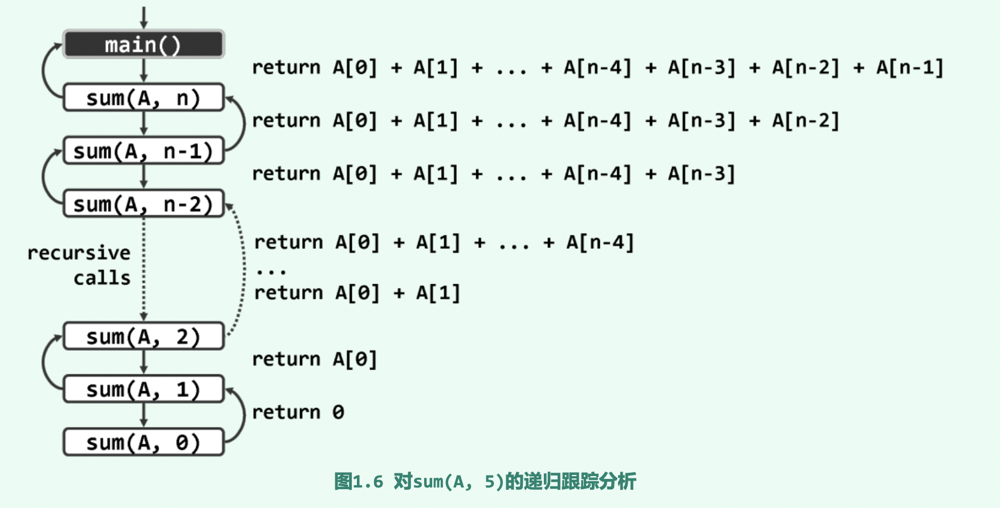
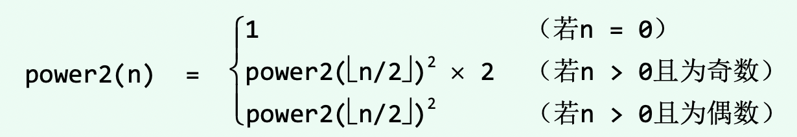
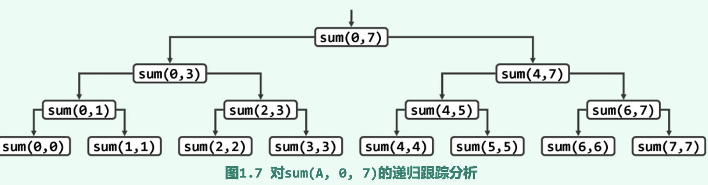
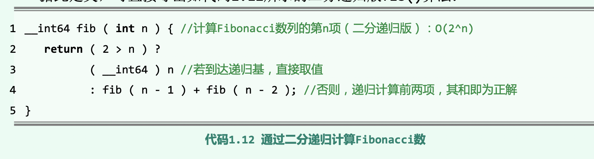
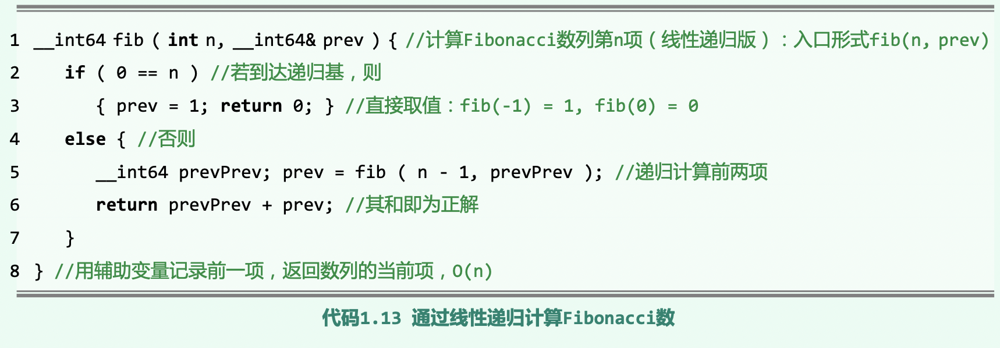
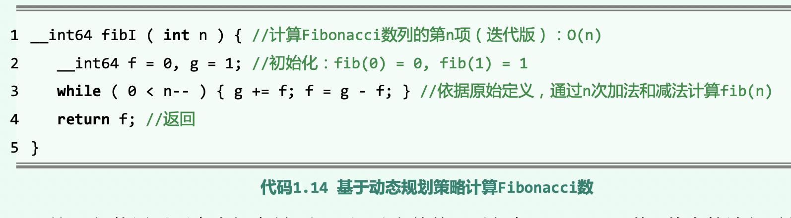

# 绪论

算法: 基于特定的计算模型, 旨在解决某一信息处理问题而设计的一个指令序列。

算法的要素: 1. 输入输出 2. 基本操作, 确定性, 可行性 3. 有穷性和正确性 4. 退化和鲁棒性 5. 重用性

## 时间复杂度:

* 时间复杂度: 从保守估计的角度出发，在规模为n的所有输入中 选择执行时间最长者作为T(n)，并以T(n)度量该算法的时间复杂度。

* 渐进复杂度: 通过时间复杂度直接比较算法优劣有些鲁莽(一些算法适合小规模输入, 另一些则相反)。我们可以忽略处理小规模数据的能力差异, 专注在处理大规模数据上。**这种着眼长远、更为注重时间复杂度的总体变化趋 势和增长速度的策略与方法，即所谓的渐进分析**

**大O符号**

算法的**最坏情况**, 即T(n)的渐进上界: 对任意n>>2, 有T(n)<= c·f(n); 则可认为在n足够大时f(n)给出了一个渐进上界, 记为:

**T(n) = O(f(n))**

由这一定义，可导出大O记号的以下性质:

(1) 对于任一常数c > 0，有O(f(n)) = O(c∙f(n)) //正的常数系数可忽略为1

(2) 对于任意常数a > b > 0，有O(na + nb) = O(na) //只保留最高项即可

**大Ω符号**

算法的**最好情况**, 即T(n)的渐进下界: 对任意n>>2, 有 T(n) >= c·g(n). 可以认为在n足够大时g(n)给出了T(n)的渐进下界, 记为:

**T(n) = Ω(g(n))**

对于规模为n的任意输入，算法的运行时间都不低于$\Omega$(g(n)) 

**大$\Theta$符号**

对算法复杂度的准确估计。

T(n) 处于 $\Omega$(g(n)) 和 O(f(n))之间, 若出现**g(n) = f(n)**的情况, 则可用该符号进行表示:

如果存在正的常数c1 < c2和函数h(n)，使得对于任何n >> 2, 都有 c1∙h(n) $\leq$ T(n) $\leq$ c2∙h(n)

就可以认为当n足够大时, h(n)给出了T(n)的一个确界, 记做**T(n) = $\Theta$(h(n))**

## 空间复杂度

算法所需存储空间的多少称为空间复杂度. 以上的渐进复杂度分析也适用于空间复杂度。

空间复杂度通常并不 计入原始输入本身所占用的空间——对于同一问题，这一指标对任何算法都是相同的。反之，其 它(如转储、中转、索引、映射、缓冲等)各个方面所消耗的空间，则都应计入。

**我们一般更关注时间复杂度而非空间复杂度, 原因: 就渐进复杂度的意义而言，在任一算 法的任何一次运行过程中所消耗的存储空间，都不会多于其间所执行基本操作的累计次数。**

**时间复杂度本身就是空间复杂度的一个天然的上界。**

## 递归

递归基: 平凡情况(等于0/1之类的很简单的结果)

### 线性递归

**减而治之**

每一递归实例对自身调用最多一次, 即每一层次至多只有一个实例, 且构成一个线性序列. 

问题可划分为两种: 1. 对应单独一个元素, 可直接求解 2. 对应剩余部分, 结构与原问题相同. 将二者合并后即可得到原问题解。

### 递归分析

递归的时间和空间复杂度和常规算法不同, 有**递归跟踪**和**递推方程**两种分析方法

**递归跟踪**

按照以下原则，将递归算法的执行过程整理为图的形式:

* 算法的每一递归实例都表示为一个方框，其中注明了该实例调用的参数 

* 若实例M调用实例N，则在M与N对应的方框之间添加一条有向联线

例:

递归实例的创建、销毁均由操作系统负责完成，其对应的时间成本通常可以近似为常数，忽略。只需统计各递归实例中非递归调用部分所需的时间。

该递归算法每次的非递归计算就3类: 1. 判断是否为递归基 2. 累加 3. 返回当前值。 且递归深度为n+1, 共创建了n+1个实例

所以时间复杂度为: O(3)x(n+1) = O(n)

每次递归调用保存的变量为: 数组起始地址 和 长度n, 因此空间复杂度也为O(n)

**递归方程**

T(n)的如下一般性的递推关系:

T(n) = T(n-1)+ O(1) = T(n-1)+c1， 其中c1为常数

当递归过程抵达递归基时，求解平凡问题sum(A, 0)只需(用于直接返回0的) 常数时间。如此，即可获得如下边界条件:

T(0) = O(1) = c2， 其中c2为常数

联立以上两个方程，最终可以解得:

T(n) = c1n + c2 = O(n)

### 递归模式

1. 多递归基

针对每一类可能出现的平凡情况，都需设置对应的递归基，故同一算法的递归基可能(显式或隐式地)不止一个。

2. 实现递归

设计算法时，需要从多个角度反复尝试，方能确定对问题的输入及其规模的最佳划分方式。

3. 多项递归

不仅递归基可能有多个，递归调用也可能有多种可供选择的分支。

### 递归消除

既然递归给我带来了那么多好处，那么**代价是什么？**

空间成本: 递归算法消耗的空间主要取决于递归深度, 较之同一算法的迭代版，递归版往往需耗费更多空间. 就os而言，为实现递归调用需要花费大量额外的时间以创建、维护和销毁各递归实例.

例: 尾递归的消除

若递归调用在递归实例中恰好以最后一步操作的形式出现, 则称为尾递归。

我们可以通过在外层增加一层循环去除它。

## 二分递归

**分治法**

无论分解为两个还是3个4个...个常数子问题, 其实对算法的时间复杂度影响都不大。

二分递归中递归基出现相当平凡, 半数左右的递归实例都是递归基

分治法的计算消耗主要有两方面: 1. 将原问题分解为形式相同, 规模更小的多个子问题 2. 子解答合并, 递归所有子问题解合并为原问题解

因此分治法只适用于那些可以保证**上述两点可以高效实现的问题, 还必须保证子问题间互相独立而无需借助其它子问题的原始数据或中间结果**

例如`Fibonacci数列的求解`, 使用二分法反而会将复杂度提高到O(2^n)

****

优化策略: 为消除递归算法中重复的递归实例, 可以借助一定量的辅助空间，在各子问题求解之后，及时记录下其对应的解答

可以从原问题出发自顶而下，每当遇到一个子问题，都首先查验它是否已经计算过， 以期通过直接调阅记录获得解答，从而避免重新计算。

也可以从递归基出发，自底而上递推地得 出各子问题的解，直至最终原问题的解。(动态规划)

例如将`Fibonacci`改为线性递归:

fib(n)由fib(n - 1)和fib(n - 2), 每次都计算一对相邻的fib数字

虽然时间复杂度降低到了O(n), 但它也需要O(n)的空间复杂度

我们采用dp策略再次更改该算法:

等效地视作从递归基出发，按规模自小而大求解各子问题的过程.

时间复杂度仍为O(n), 但空间复杂度降为常数

## 抽象数据类型

各种数据结构都可看作是由若干数据项组成的集合，同时对数据项定义一组标准的操作。

数据集合及其对应的操作可超脱于具体的程序设计语言、具体的实现方式， 即构成所谓的抽象数据类型 ADT
