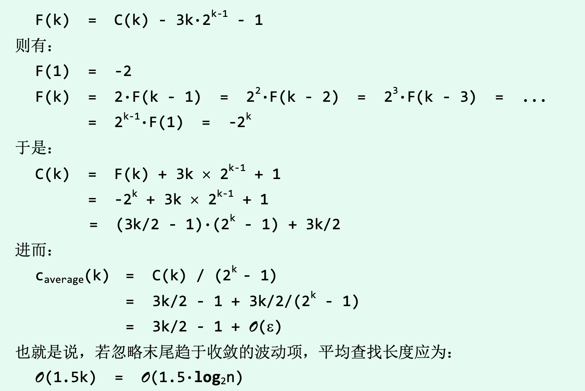

# 向量

数据结构是数据项的结构化集合, 其结构表现在数据间的相互联系和作用(某种次序). 根据次序可分为: `线性结构, 半线性结构, 非线性结构`三类。

线性结构中各数据项按照线性次序构成一个整体, 最基本的线性结构称为序列. 根据数据项的**逻辑次序和其物理位置**的不同可分为: vector 和 list. vector中数据项的物理存放位置和逻辑顺序(rank)完全一致; list中逻辑上相邻的数据未必物理上相邻,而是通过间接定址的方式**相互引用的**

## 数组to向量

向量是对数组的抽象和泛化: 由线性次序的一组元素构成, 其中的元素由秩相互区分.

秩: 元素e的前驱有n个, 那么其秩就为n

## 构造和析构

在基于复制的构造函数中, 我们需要对`=`运算符进行重载: 

vector 内部类型若非c++基础类型, 包含动态分配的空间, 简单的`=` 无法起作用

学到了**返回this引用的知识**

先看看`this` 是如何发挥作用的:

1. 调用成员函数的时候，编译器负责把对象地址传（&myTime）递给成员函数中隐藏的this形参。在系统角度来看，任何对类成员的直接访问都是被this隐式调用的。

2. this 有一个 const 修饰符, 指向确定的对象, 不可更改

3. 在普通成员函数 this为一个指向非const对象的const指针; 在const成员函数中, 为double const

返回 `*this`, 即返回了调用成员函数的instance的引用.(const 函数返回const引用)

## 动态空间管理

向量实际规模与其内部数组容量的比值(即_size/_capacity)，亦称作装填因子(load factor)，它是衡量空间利用率的重要指标.

**如何才能保证向量的装填因子既不致于超过1，也不致于太接近于0?**这是一个很重要的问题. 我们需要抛弃静态空间, 转向动态空间管理.

**如何扩充?每次扩充多少合适?**

由于vector内容物理地址连续, 所以无法在原地址空间进行尾追. **另行申请一个空间, 进行copy**

我们在这里选择每次扩充时, 新数组的容量都会扩充为原数组的**两倍**

每一次从n到2n的扩容, 都需要花费 O(2n) = O(n)的时间: **最坏情况下单次插入需要的时间**, 似乎效率很差, 但这是**错觉**:

每花费O(n)时间进行一次扩容, 至少需要再经过n次插入, 才可能会因溢出而再次扩容. 随着向量规模的不断扩大, 插入前进行扩容的概率也逐渐降低, **就平均成本来看, 并不高**

**分摊复杂度:** 对可扩充向量进行足够多的连续操作, 并将其所消耗的时间分摊至所有操作. 分摊到单次操作的成本叫做**分摊运行时间**

对该结构的连续n次(查询、插入或删除等)操作，将所有操作中用于内部数组扩容的时间累计起来，然后除以n。只要n足够大，这一平均时间就是用于扩容处理的分摊时间成本。

即便排除查询和删除操作而仅考查插入操作，**在可扩充向量单次操作中，用于扩容处理的分摊时间成本也不过O(1).**

数组容量为 N, 即将溢出, 连续进行 n>>N次插入. size(n): 连续插入n个元素后向量规模; capacity(n): 连续插入n个元素后数组容量; T(n): 连续插入n个元素2而花费的扩容时间.

size(n) = N+n

size(n) <= capacity(n) < 2*size(n)

所以 capacity(n) = $\Theta$(size(n)) = $\Theta$(n)

共做了$\Theta log_2n$次扩容, T(n):

T(n)= 2N + 4N + ... + capacity(n) < 2* capacity(n) = $\Theta$(n)

将其分摊到n次操作上面, 可以得到单次操作的分摊时间为 O(1)

**任何其他扩容固定数目的单元的策略, 其分摊时间复杂度均为$\Omega (n)$**

**缩容**

导致低效率的另一原因是向量的实际规模可能远远小于内部数组的容量. 当装填因子低于某一阈值时, 我们称数组发生了 **下溢**.

代码中给出了一个动态缩容的算法 `shrink()`, 也采取了每次减半的策略. 是`expand()`的逆过程. 均摊时间复杂度也为O(1).

## 常规向量

### **直接引用元素**

与数组直接通过下标访问元素的方式(形如“A[i]”)相同, 重载运算符`[]`, 返回Vector元素的引用. 

### **判等器和比较器**

“判断两个对象是否相等”与“判断两个对象的相对大小”都是至关重要的操作. 前者多称作“比对”操作，后者多称作“比较”操作。当然，这两种操作之间既有联系也有区别，不能相互替代。比如，有些对象只能比对但不能比较;反之, 支持比较的对象未必支持比对。

可用两种方式: 1.将比对和比较操作分别封装为通用的判等器和比较器. 2. 在定义数据类型时, 重载 `< ==`之类的符号, 给出大小和相等关系的定义和评判方法.

一些复杂数据结构中, 内部元素本身的类型可能就是指向其他对象的指针; 此时外部更多关注的往往是所指对象的大小, 需要特殊处理.

### **无序查找**

`find(T const&e, Rank lo, Rank hi)`

仅支持比对，但未必支持比较的向量，称作无序向量.

进行顺序查找, 遍历vector直到找到对应元素/未找到

当同时有多个未命中元素时, 返回其中秩最大的. 一旦命中即返回, 不用再进行不必要的比对. 查询失败返回-1.

针对不同输入, 我们的顺序查找算法的时间复杂度时是不同的. 是`输入敏感的算法`

### **插入**

`insert(Rank r, T e)`, 将任意给定的元素e插到任意指定的秩为r的单元.

需要将指定rank及之后的元素向后移动一个单位

时间复杂度主要在后继元素的后移, O(n)

### **删除**

`remove(Rank r); remove(Rank lo, Rank hi);`

前者是后者的特例, 不可利用前者实现后者, 因为: 每次remove一个元素, 都会把后面的元素前移, 将会一直删除元素.

区间删除操作所需的时间仅取决于后继元素的数目, 与删除长度无关. 对于单元素删除, O(_size-r), 最好为O(1), 最差为O(_size)

### **唯一化**

针对向量是否有序, 有两种实现方式, 首先介绍无序版本的方式.

即针对每一个元素, 在其前缀中找是否相同的元素, 如果有, 删除该元素, 否则, 继续考察其后继.

复杂度, 随着循环的进行, 元素的后继持续减少, n-2步后算法必然终止.

每步迭代需要O(n)的时间复杂度, 总复杂度= O(n^2)

### **遍历**

算法中往往需要对vector所有元素实施某种统一的操作, 比如输出向量中所有元素, 或按某种运算流程修改所有元素的数值. 针对此类操作可设置一个便利接口`traverse()`

```cpp
template <typename T> void Vector<T>::traverse ( void ( *visit ) ( T& ) ) //借助函数指针机制
 { for ( int i = 0; i < _size; i++ ) visit ( _elem[i] ); } //遍历向量

template <typename T> template <typename VST> //元素类型、操作器
void Vector<T>::traverse ( VST& visit ) //借助函数对象机制
{ for ( int i = 0; i < _size; i++ ) visit ( _elem[i] ); } //遍历向量
```

前者可借助函数指针, 指定某一函数, 对向量元素进行操作. 后者则借用函数对象, 将操作符()重载后在形式上等价于一个函数接口.

函数对象的功能更强, 适用范围更广. 比如，函数对象的形式支持对向量元素 的关联修改。也就是说，对各元素的修改不仅可以相互独立地进行，也可以根据某个(些)元素的数值相应地修改另一元素。前一形式虽也可实现这类功能，但要繁琐很多。

复杂度只需要遍历一遍vector即可, 为O(n)

## 有序向量

若向量S[0,n) 中所有元素不仅按线性次序存放, 其数值大小也按此次序单调分布, 则称为有序向量. 不要求元素互异, 通常约定其中的元素自左向右构成一个非降序列, 即对任意的 0 <= i < j < n 都有 S[i] <= S[j]

### **有序性甄别**

计算逆序数, 若为0则有序, 否则无序.

### **唯一化**

为了清楚无序向量中的重复元素, 一般做法往往是首先将其转化为有序向量.

低效版算法:

从起始元素开始, 对比各对相邻元素, 若雷同则remove该元素, 若不雷同则处理后一元素.

因为每次迭代都可能需要执行一次remove, 该算法的最坏的时间复杂度为 O(n^2), 我们可以看出其与无序向量唯一化的时间复杂度相同, 说明**没有充分利用向量的有序性**

高效算法:

低效算法的主要问题是在于对remove函数调用次数过多, 且同一元素可能需要向前移动多次, 但remove每次仅移动一个单元.

**在有序向量中每组重复元素都必然前后紧邻地集中分布, 可以区间为单位, 大批量删除重复元素**

所以我们只需要在vector中寻找各重复元素区间的第一个元素即可, 若找到与当前元素不同的元素, 将其移动到当前元素右边, 

复杂度, while循环的每一次迭代只需要对元素值进行比较, 并移动指针位置即可. 只需要常数时间. 且迭代只需n次. 所以时间复杂度为O(n)

### 查找

有序向量的查找可以利用元素间的有序性, 缩小需要查找的范围, 可以跟高效地完成. 可以提升至O(logn)

**二分查找(版本A)**

每经过至多两次比较操作，我们或者已经找到目标元素，或者可以将查找问题简 化为一个规模更小的新问题

每次迭代有效查找空间的宽度将以1/2的比例以几何级数的速度递减. 所以总体的时间复杂度不超过O(logn)

**查找长度**: 算法中执行的元素大小比较操作的次数, 是评估算法整体效率的因素.

对于上述算法的成功查找长度可以列出下列式子:

对于长度为$2^{k}-1$的有序向量, 对应的平均成功查找长度记为$C_{average}(k)$, 所有元素对应的查找长度的总和定位为 $C_k=C_{average}(k)*(2^k-1)$

当k=1时, C_a(1)=C(1)=1

C(k) = [C(k - 1) + ($2^{k-1}$ - 1)] + 2 + [C(k - 1) + 2*($2^{k-1}$ - 1)] = 2∙C(k-1)+3∙$2^{k-1}$ -1

若:



**失败查找长度也是O(1.5*logn)**

二分查找虽然可以保证logn的时间复杂度, 但其系数1.5还是不太好, **主要原因在于确定左右分支时需要的比较次数不同**

解决方案:

1. 调整前、后区域的宽度，适当地加长(缩短)前(后)子向量

2. 统一沿两个方向深入所需要执行的比较次数，比如都统一为一次

**黄金分割**

不必要求mi居中, 按黄金分割比来确定mi, mi = fib(k-1) -1

前后子向量长度分别是: fib(k-1)-1; fib(k-2)-1 = fib(k) -1 - (fib(k-1)-1) -1

**也称为Fibonacci查找**

**二分查找版本B**, 从三分支变成两分支

若目标元素小于A[mi], 则深入[lo, mi) 继续查找; 否则深入后端[mi, hi)继续查找.

因此，最好情况下的效率有所倒退。当然，作为补偿，最坏情况下的效率相应地有所提高。实际上无论是成功查找或失败查找，版本B各分支的查找长度更加接近，故整体性能更趋稳定。

a more tricky way:

```cpp
template <typename T>
static Rank binsearch(T* A, T const& e, Rank lo, Rank hi){
    while(lo < hi){
        Rank mi = (lo+hi)>>2;
        (e < A[mi]) ? hi = mi : lo = mi+1;
    }
    return --lo;
}
```
该算法中[0, lo) 元素皆不大于e; [hi, n) 中元素皆大于e. 循环终止时, lo = hi, 此时A[lo-1] 作为[0, lo)中最后一个元素, 必定不大于e, A[lo]作为[hi,n)第一个元素, 一定大于e, 因此**只需要返回lo-1即可**.

## 排序和下界

有序向量的查找等操作效率远高于一般向量, 因此在实际中常常先将向量转化为有序向量, 再调用有序向量的高效算法. 

有不同的分类:

1. 内部排序/外部排序: 根据数据是否存放在内存中.

2. 离线算法/在线算法: 数据是已经生成完毕还是在等待数据到达.

### 复杂度下界

任一问题在最坏情况下的最低计算成本, 即为该算法的复杂度下界. 若某一算法的性能达到改下界, 则其已是最坏情况下最优的了.

完全取决于不同变量或常量的比对或比较结果，则该算法所有可能的执行过程都可表示和概括为一棵比较树.称为**基于比较式算法**, **CBA算法**

常用其生成的比较树高来评价其复杂度下界(log2(N))(N为可能的输出结果数)

### 排序器

归并排序是第一个能够在最差情况下依然保持O(nlogn), 通过反复调用二路归并算法来实现的: 二路归并就是将两个有序序列合并成为一个有序序列. 

二路归并算法在任何时刻只需载入两个向量的首元素，故除了归并输出的向量外，仅需要常数规模的辅助空间。另外，该算法始终严格地按顺序处理输入和输出向量，故特别适用于使用磁带机等顺序存储器的场合。

