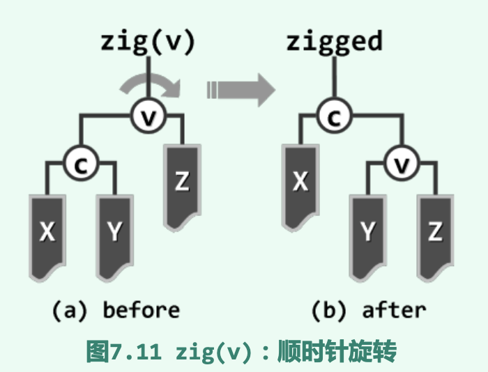
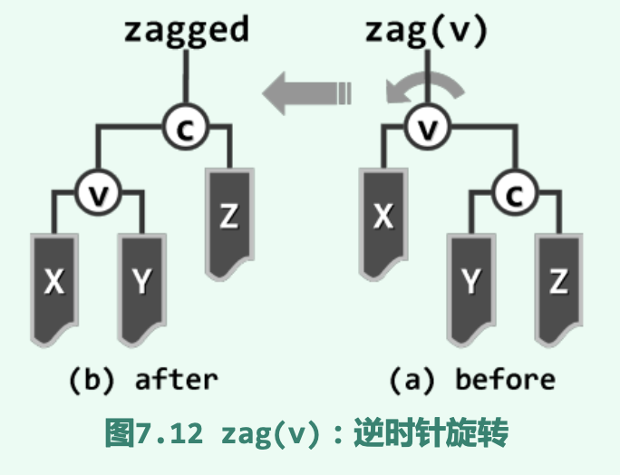
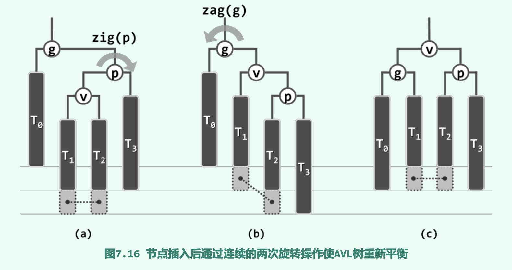
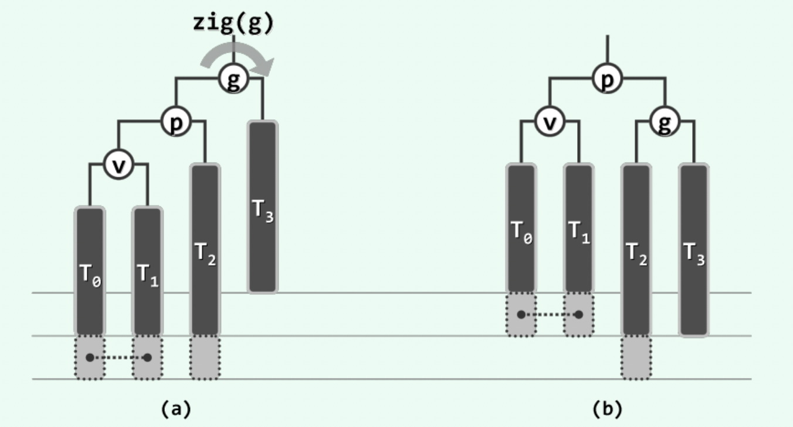
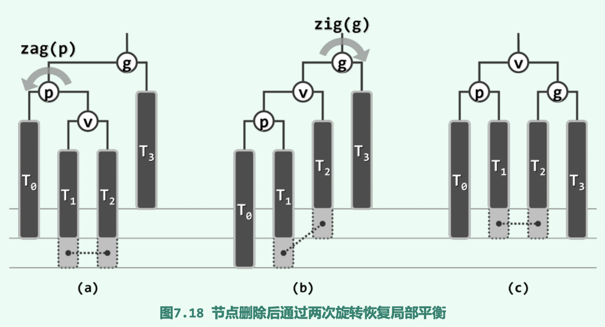
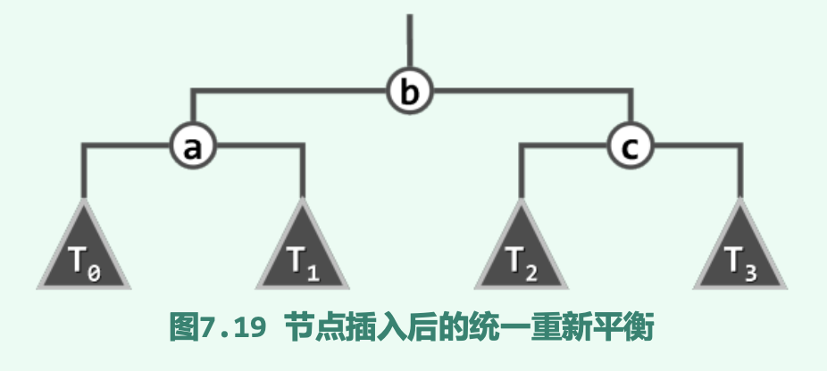

# 搜索树

先前的`vector`和`list`无法同时满足高效率地查找和动态调整, 其线性结构造成了限制.  因此提出`树式查找`

## 查找

查找即: 从一组数据对象中找出符合条件者, 其中的数据对象叫做`词条`; 不同词条间依靠各自的关键码`key`进行区分. 

查找的过程和结果, 仅仅取决于目标对象的`key`, 该方式为循key访问.

因此词条的数据结构定义如下:

```cpp
template <typename K, typename V> struct Entry { //词条模板类
    K key; V value; //关键码、数值
    Entry ( K k = K(), V v = V() ) : key ( k ), value ( v ) {}; //默认构造函数
    Entry ( Entry<K, V> const& e ) : key ( e.key ), value ( e.value ) {}; 
    //基于克隆的构造函数
    bool operator< ( Entry<K, V> const& e ) { return key < e.key; } 
    //比较器:小于
    bool operator> ( Entry<K, V> const& e ) { return key > e.key; } 
    //比较器:大于
    bool operator== ( Entry<K, V> const& e ) { return key == e.key; } 
    //判等器:等于
    bool operator!= ( Entry<K, V> const& e ) { return key != e.key; } 
    //判等器: 不等于
}; //得益于比较器和判等器，从此往后，不必严格区分词条及其对应的关键码
```
根据重载的操作符来看, 词条的判等和比较操作即为关键码的判等和比较操作. 当然在某些情况下, 词条之间的比较可能没有现实意义/在一些追求高效的场合并不需要所有元素间都可以比较, 只关心个别元素.

## Binary Search Tree

BST具有顺序性: `任一节点r的左(右)子树中, 所有节点均不大于(不小于)r`, 即左子树节点都<=r, 右子树节点都 >= r. 

因此其中序遍历的结果一定是一个`非降序序列`

### 查找算法

减而治之,其过程为: 从根节点出发, 逐步缩小查找范围, 直到发现目标(成功)或缩小至空树(失败)

即一旦发现当前节点为null则说明查找范围为空, 查找失败; 否则, 视关键码比较结果, 小于则向左深入|大于则向右深入|相等则报告成功. 

因此, 可以看出, 查找算法的复杂度主要 `取决于树的高度`, 因此`平衡二叉搜索树`的提出也具有了很大的意义.

### 插入算法

为了在二叉树插入节点, 首先用`search`算法确定插入的位置及方向, 然后将新节点作为叶子插入.然后更新插入节点及其祖先的高度信息.

效率: 时间消耗主要在`search`算法和`updateHeightAbove`算法上面, 每层至多调用一个节点, 因此其**效率也取决于新节点的深度, 最坏情况下不超过全树的高度**

### 删除算法

当删除只有左孩子/右孩子的节点时, 用其孩子代替该节点即可. 若删除一个双子节点, 那么需要用`succ`算法找到其直接后缀, 然后将其二者交换, 删除该后继节点即可. **该后继节点一定无左孩子**, 然后更新节点的高度即可.

## 平衡二叉树

### 树高和性能

先就二叉搜索树的平均性能做一比较:

若从空树开始, 对于n个互异的关键码一次执行insert操作即可得到一个二叉搜索树, **显然, 任意n个关键码都可以构成 n!种全排列, 所以平均高度为 O(logn)**

另一方法是, 假定n个互异节点同时给定, 在遵守顺序性的前提下, 随机确定其拓扑结构. 则由n个节点组成的二叉搜索树共有 **(2n)!/n!/(n+1)!**棵, 若其出现概率相等, 则**平均查找长度为 O(sqrt(n))**

实际上, 越是平衡的树被统计的次数越多, 前一种平均方式中无意地高估了二叉搜索树的性能, 因此后面的估计更可信.

且若按照removeAt()代码的实现, 每次删除双子节点时都找其直接后继, 那么随着操作次数的增加, 整个树左偏的趋势将愈发明显.

### 理想平衡和适度平衡

理想平衡: 对于包含n个节点的二叉树, 若高度正好等于 $log_2n$(向下取整), 成为理想平衡树.

适度平衡: 在渐进意义下适当放松标准之后的平衡性, 即渐进地不超过$O(log_n)$. 

### 等价变换

若两棵二叉搜索树的中序遍历序列相同, 则称他们等价. 即二叉树的垂直高度可能有所不同, 但水平次序完全一致, "上下可变, 左右不乱"

二叉搜索树的适度平衡性是根据一些局部性来保证的(例如在红黑树中从树根到叶节点的通路总是包括一样多的黑节点;在VAL树中, 兄弟节点的高度相差不过1):

1. 单次动态修改后, 至多只有O(1)处局部不再满足限制条件.

2. 总可在O(logn)时间内使这O(1)处局部(乃至全树)重新满足限制条件.

即刚失去平衡的二叉搜索树可迅速地转化为一棵等价的平衡二叉搜索树. 

### 修复局部性: 旋转调整

zig: 顺时针旋转; zag: 逆时针旋转. 

例: c和Z是v的左孩子和右子树, X和Y是c的左右子树. 则zig(v)的效果为: X和v是c的左子树和右孩子, YZ是v的左右子树.





可以看到其中序遍历序列和之前相同, 属于等价变换.

每一次zig/zag操作后, 节点v的深度+1, 节点c的深度减1; 局部子树的高度可能发生变化, 但上下幅度不超过1层.

## AVL树

在渐进意义下, AVL树可以始终将其高度控制在O(logn)以内, 从而保证每次查找, 插入, 删除操作均可在O(logn)的时间内完成. 

### 定义及性质

* 平衡因子: 任意一点的平衡因子定义为"其左右子树的高度差"(空树高度为-1, 单节点树高度为0)

AVL树即平衡因子受限的二叉树: 其中各节点的平衡因子的绝对值不超过1

AVL树的平衡性证明:高度为h的AVL树至少包含fib(h+3)-1个节点

1. 当h=0时, T中至少包含fib(3)-1 = 2-1 =1个节点;

2. 当h=1时, T中至少包含fib(4)-1 = 3-1 =2个节点;

3. 假设对于高度低于h的任何AVL树以上命题成立

4. |S| = 1 + |Sl| + |Sr|, Sl和Sr也是AVL树且高度不超过h-1, 因此|S| = 1+fib(h+2)+fib(h+1) -1 = fib(h+3)-1

因此AVL树的高度应为O(logn), 在渐进意义上是平衡的

****

AVL树的插入/删除等动态修改操作后不满足AVL树条件, 因节点x的插入和删除而暂时失衡的节点集合记作UT(x).

若x为被摘除的节点, 则UT(x)仅含单个节点; 但若x为被引入的节点, 则UT(x)可能包含多个节点.

### 节点插入

引入新节点x后, UT(x)中的节点都是x的祖先, 且高度不低于x的祖父. 

其中最深的记作g(x), 在x和g(x)之间的通路上, 设p为g(x)的孩子, v为p的孩子.(因为g(x)不低于x的祖父, 则p一定是x的真祖先)

可以从x出发沿着parent指针逐层上行并检查平衡因子, 首次遇到的非平衡祖先即为g(x). 

因为g(x)是因为x的插入而失衡, 则p和v的高度均不会低于其各自的兄弟, 可由此从g(x)找到p和v:

```cpp
#define tallerChild(x)(
    stature(x->lc) > stature(x->rc) ? x->lc :(
    stature(x->lc) < stature(x->rc) > x->rc :(
    IsLChild(*(x)) ? x->lc : x->rc
    )
    )
)
```

即p,v是失衡节点的更高孩子, 更高孙子节点.

* 单旋

**v是p的右孩子, p是g的右孩子**

必然是在子树v中插入节点后使g(x)不平衡. 可以通过zag(g(x))得到一棵等价二叉搜索树. 

*使用zig(g(x))可以处理对称的失衡状态*

* 双旋

**v是p的左孩子, p是g的右孩子**

首先顺时针旋转zig(p), 然后zag(g(x)),得到等价的二叉搜索树. 重归平衡.



显然可得通过zag(p)和zig(g(x))可以处理对称的情况.

无论是单旋还是双旋, 经过局部调整后不仅g(x)能重新平衡, 局部子树的高度也可以复原. 即g(x)以上所有祖先的平衡因子亦将统一地复原. 换而言之，在AVL树中插入新节点后，仅需不超过两次旋转，即可使整树恢复平衡。

### 节点删除

与插入节点不同, 删除节点x后, 以及随后的调整过程中, 失衡节点集UT(x)始终至多含有一个节点. 且若该节点g(x)存在, 其高度必然和失衡前相同. 还有一点就是g(x)有可能就是x的父亲. 

* 单旋

由于在T3中删除了节点导致g(x)不平衡, 但当p的平衡因子非负时, 以g(x)为轴顺时针旋转一次即可恢复局部平衡.



图中以虚线联接的灰色方块所对应的节点，不能同时为空;T2底部的灰色 方块所对应的节点，可能为空，也可能非空。

* 双旋

g(x)失衡时若p的平衡因子为-1, 则以p为轴的一次逆时针旋转后即可转为上图情况.



与插入操作不同, 在删除节点后尽管也可以通过单旋/双旋调整使得局部子树恢复平衡, 但恢复平衡后**局部子树的高度可能会改变, 导致全局再次失衡.** *由低层失衡节点的重平衡导致高层祖先失衡的现象叫失衡传播.*

## 统一重平衡算法

在g(x)更高一侧的子树内, 其孩子节点p和孙子节点v必然存在, 而且这一局部必然可以按g(x),p,v为界,分解为四颗子树: 按中序遍历次序重命名为$T_0和T_3$

同样按照中序遍历, 重新排列g(x),p,v将其命名为a,b,c. 中序序列为: $\{T_0, a, T_1, b, T_2, c, T_3\}$ 



且这四颗树的高度相差不超过1, 因此这四颗树重新组装起来仍是一颗AVL树.

