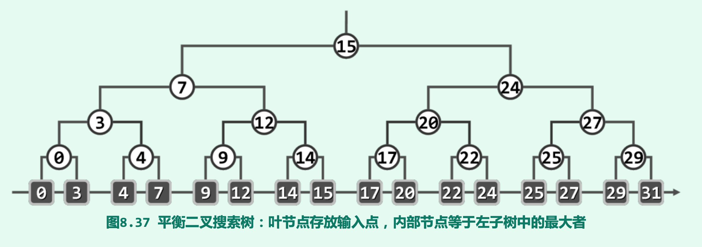

# 高级搜索树

本章介绍了`平衡二叉树家族的 伸展树`, 其最坏情况下单次操作仍需O(n)时间, 但分摊时间复杂度在O(logn) 和`平衡多路搜索树: B-树和4阶B-树的变形红黑树`. 他们都可以有效的弥补不同存储级别之间访问速度的差异, 红黑树还可以通过保持适度平衡限制单次操作成本, 且每次重平衡的调整次数在常数时间. 最后针对在平面范围查询应用, 介绍了基于平面子区域正交化分的kd树. 是对4/8叉树结构的一般性推广. 

## 伸展树

伸展树也是平衡二叉树的一种, 伸展树无需任何时刻都严格保持全树的平衡, 也不需要平衡因子/高度等信息, 适用范围更广.

### 局部性

对应时间和空间局部性, 二叉搜索树的局部性描述为:

1. 刚刚被访问过的节点，极有可能在不久之后再次被访问到 

2. 将被访问的下一节点，极有可能就处于不久之前被访问过的某个节点的附近

### 简易伸展树(逐层伸展)

`每访问过一个节点之后, 随即反复地以其父节点为轴, 经适当的旋转将其提升一层, 直至最终成为树根.`


随着节点E逐层上升, 两侧子树的结构也不断调整, 被称为`伸展`. 但对于一些访问序列, 其平均时间复杂度可达到O(n):


可以看到, 上图中总共需要(n-1)+ { (n - 1) + (n - 2) + ... + 1 } = $\Omega$(n^2)次, 平均时间复杂度为O(n), 且上述情况会反复出现, 不会随着访问次数的增加而改善.

### 双层伸展(解决上述问题)

方案: **将逐层伸展改为双层伸展, 每次都从当前节点v向上追溯两层, 并根据其父亲p和祖父g的相对位置进行相应的旋转.**

**zig-zig/zag-zag**


与之前不同的是此时的选择次序为: **首先以g为轴旋转, 然后才以p为轴旋转**

**zag-zig/zig-zag**

就和之前AVL树选择的次序相同, 首先是p, 再是g.

当深度为奇数时, 最后还需要一步zig/zag.

*****

导致之前的最坏情况的原因可以描述为: 在这一可持续重复的过程中, 二叉搜索树的高度始终不小于n/2, 且至少一半节点接受访问时不靠近树根反而在最底层. **即在访问过程中, 树高依次从n-1递减到n/2, 然后又递增到n-1**

下面是最坏情况的改善结果:


可以看到每次访问底层节点时, 对应分支都会收缩到原来的一半. 有效减少了最坏情况发生的频度.

## B-树

### 多路平衡查找

现代计算机采用分级存储的策略, 在两个相邻存储级别之间的数据传输称为I/O操作. 各级存储器的访问速度相差悬殊, 应尽量减少I/O操作.

当数据规模大到内存已不足以容纳时，常规平衡二叉搜索树的效率将大打折扣。其原因在于查找过程对外存的访问次数过多.

可利用磁盘等存储介质的特性: 就时间成本而言, 读取物理地址的1000个bytes和读一个byte几乎没有区别. 即**更适合批量访问, 通过多次内存操作代替单次外存操作**.需要将 通常的二叉搜索树，改造为多路搜索树. 在中序遍历的意义下，这也是一种等价变换。


所有外部节点深度均相同, 每个内部节点都存有不超过m-1个关键码, 以及用以指示对应分支的不超过m个引用:

存有n ≤ m-1个关键码的节点: K1 < K2 < K3 ... < Kn, 同时也有n+1 ≤ m个引用: A0 < A1 < A2 < A3 ... < An. 同时, 各内部节点的分枝数也不能太少, 都应满足, n+1 ≥ m/2(up). 而在非空的B-树中, 根节点的n+1 ≥ 2.

### 关键码查找

首先以根节点作为当前节点，然后再逐层深入。若在当前节点(所包含的一组关键码)中能够找到目标关键码，则成功返回。否则(在当前节点中查找“失败”)，则必可在当前节点中确定某一个引用(“失败”位置)，并通过它转至逻辑上处于下一层的另一节点。若该节点是外部节点，则将其载入内存，并更新为当前节点，然后继续重复上述过程。

与二叉树唯一不同的点就是: 此时各节点内通常包含多个key, 可能需要在内存中多次比较才能确定转向下一层的哪个节点并继续.

```cpp
template <typename T> BTNodePosi(T) BTree<T>::search ( const T& e ) { //在B-树中查找关键码e 
BTNodePosi(T) v = _root; _hot = NULL; //从根节点出发
while ( v ) { //逐层查找
    Rank r = v->key.search ( e ); //在当前节点中，找到不大于e癿最大关键码
    if ( ( 0 <= r ) && ( e == v->key[r] ) ) return v; //成功:在弼前节点中命中目标关键码 
    _hot = v; v = v->child[r + 1]; //否则，转入对应子树(_hot指向其父)——需做I/O，最费时间
} //返里在向量内是二分查找，但对通常的_order可直接顺序查找 
return NULL; //失败:最终抵达外部节点
```

综上所述: B-树的查找操作所需时间由两部分组成: 1.将某一节点载入内存. 2. 在内存中对当前节点进行查找.

由于后一操作时间远小于前一操作, 所以主要由外存访问时间组成. 对于高度为h的B-树, 外存访问不过O(h-1)次.

B-树节点的分枝数, 故其高度h并不完全取决于树中关键码的总数n。对于包含N个关键码的m阶B-树，高度h具体可在多大范围内变化?

可以证明, 若存有N个关键码的m阶B-树高度为h, 则必有: logm(N+1) ≤ h ≤ log(m/2)(up)((N+1)/2)(down)+1= O(logm(N)), 因此存有N个关键码的m阶B-树高度h = $\Theta$(logmN).

因此, 对存有N个关键码的m阶B-树的每次查找操作, 耗时不超过O(logmN)

### 关键码插入

```cpp
template <typename T> bool BTree<T>::insert ( const T& e ) { //将关键码e插入B树中
    BTNodePosi(T) v = search ( e ); if ( v ) return false; //确认目标节点不存在 
    Rank r = _hot->key.search ( e ); //在节点_hot的有序关键码向量中查找合适的插入位置 
    _hot->key.insert ( r + 1, e ); //将新关键码插至对应的位置
    _hot->child.insert ( r + 2, NULL ); //创建一个空子树指针
    _size++; //更新全树规模
    solveOverflow ( _hot ); //如有必要，需做分裂
    return true; //插入成功
}
```
首先使用`search(e)`查找该关键码, 若不存在, 则其查找过程必然停止在一个外部节点v, 且父节点由_hot指示, 此时的_hot一定指向某一叶节点. 接下来, 在该叶节点的关键码向量中查找e, 得到其应该插入的位置.

此时_hot的关键码增加了一个, 若其总数依然合法(≤m-1), 则插入完成. 否则, 产生上溢, 需要进行处理.

### 上溢与分裂

一般刚发生上溢的节点, 恰好有m个关键码, 取s= m/2(down), 则依次为: {k0 ... ks-1; ks; ks+1 ... km-1}, 以ks为界, 可将节点分为前后两个子节点, 且二者大致等长. 于是, 可令关键码ks上升一层, 归入父节点中合适的位置. 并分别以这两个孩子为其左右孩子. 该过程叫 `分裂`.


被提升的节点有如上三种处理方式: 1. 父节点存在且可以接收一个关键码, 只需将被提升关键码插入父节点即可. 2. 父节点存在但不能接收1个关键码, 则产生了上溢的传递, 插入后再对父节点进行操作. 3. 若上溢传递至根节点, 没有父节点, 则令被提示的节点自成一个节点, 作为新的树根. 修复完成, 全树增高一层.

```cpp
template <typename T> //关键码插入后若节点上溢，则做节点分裂处理 
void BTree<T>::solveOverflow ( BTNodePosi(T) v ) {
    if ( _order >= v->child.size() ) return; //递归基:当前节点未上溢
    Rank s = _order / 2; //轴点(此时应有_order = key.size() = child.size() - 1)
    BTNodePosi(T) u = new BTNode<T>(); //注意:新节点已有一个空孩子
    for ( Rank j = 0; j < _order - s - 1; j++ ) { //v右侧_order-s-1个孩子及关键码分裂为右侧节点u
        u->child.insert ( j, v->child.remove ( s + 1 ) ); //逐个移动效率低 
        u->key.insert ( j, v->key.remove ( s + 1 ) ); //此策略可改进
    }
    u->child[_order - s - 1] = v->child.remove ( s + 1 ); //移动v最靠右的孩子
    if ( u->child[0] ) //若u的孩子们非空，则
        for ( Rank j = 0; j < _order - s; j++ ) //令它们的父节点统一
            u->child[j]->parent = u; //指向u

    BTNodePosi(T) p = v->parent; //v当前的父节点p
    if ( !p ) { _root = p = new BTNode<T>(); p->child[0] = v; v->parent = p; } //若p空则创建节点
    Rank r = 1 + p->key.search ( v->key[0] ); //p中指向u的指针的秩
    p->key.insert ( r, v->key.remove ( s ) ); //轴点关键码上升
    p->child.insert ( r + 1, u ); u->parent = p; //新节点u与父节点p互联
    solveOverflow ( p ); //上升一层，如有必要则继续分裂——至多递归O(logn)局
}
```
可以看到solveOverflow()算法至多递归O(logmmN)次, 因此每次插入操作都可以在O(logmN)时间内完成.

### 关键码删除

```cpp
template <typename T> bool BTree<T>::remove ( const T& e ) { //从BTree树中删除e
    BTNodePosi(T) v = search ( e ); if ( !v ) return false; //确认目标关键码存在
    Rank r = v->key.search ( e ); //确定目标关键码在节点v中的秩(由上，肯定合法)
    if ( v->child[0] ) { //若v非叶子，则e的后继必属于某叶节点
        BTNodePosi(T) u = v->child[r+1]; //在右子树中一直向左，即可
        while ( u->child[0] ) u = u->child[0]; //找出e的后继
        v->key[r] = u->key[0]; v = u; r = 0; //并与其交换位置
    } //至此，v必然位于最底层，且其中第r个关键码就是待删除者
    v->key.remove ( r ); v->child.remove ( r + 1 ); _size--; //初除e，以及其下两个外部节点之一
    solveUnderflow ( v ); //如有必要，需做旋转/合并
    return true;
}
```

### 下溢与合并

在m阶B-树中, 刚发生下溢的节点V必然恰好包含(m/2)(up)-2个关键码和(m/2)(up)-1个分支. 根据其左右兄弟所含关键码的数目分三种情况处理:

1. V的左兄弟L存在, 且至少包含(m/2)(up)个关键码


2. V的右兄弟R存在, 且至少包含(m/2)(up)个关键码


3. V的左右兄弟不存在或其包含的关键码均不足(m/2)(up)个


此时V的左右兄弟不可能同时不存在, 且二者的关键码数量之和一定为 (m/2)-2 + (m/2)-1, 可从父节点中抽出介于L和V之间的关键码y, 通过其连接L和V, 关键码总数为:(m/2)-2 + (m/2)-1 + 1 = 2x(m/2) -2 ≤ m-1, 得到一个节点, 下溢的修复得以完成.

同样, 下溢的修复也需要考虑传递的因素. 若下溢现象传递到树根, 且树根仅含一个关键码. 那么原树根退化为单节点, 需要删除该节点, 并以新和成的点作为根(整树高度减一).

每次关键码的删除都可以在O(logmN)的时间内完成.

## 红黑树

平衡二叉树中伸展树最坏情况下单次操作需要O(n)的复杂度, 难以用于一些稳定性要求高的场景; AVL树尽管可以保证最坏情况下的单次操作速度, 但需要加入平衡标识, 且删除操作之后的重平衡可能做多达$\Omega (logn)$次旋转, 导致全树的拓扑结构大幅改变.

红黑树即是对后一不足的改进, 红黑树可以保证: 在每次插入/删除操作后的重平衡阶段, 全树的拓扑结构的更新仅涉及常数个节点. 尽管最坏情况下需要对$\Omega logn$个节点重新染色, 但就分摊意义来说仍仅为O(1)个.

**红黑树的适度平衡标准可大致描述为: 任一节点左右子树的高度相差不得超过两倍**

### 定义与条件

由红,黑两色节点组成的二叉搜索树若满足以下条件, 即为红黑树:

1. 树根始终为黑色

2. 外部节点均为黑色

3. 其余节点若为红色, 则其孩子节点必为黑色

4. 从任一外部节点到根节点的沿途, 黑节点的数目相等.

从根节点到任一节点的沿途, 黑节点都不少于红节点, 除去根节点本身, 沿途经历的黑节点总数称为该节点的黑深度. 根节点的黑深度为0.

在从任一节点通往其任一后代外部节点的沿途，黑节点的总数亦必相等。除去(黑色)外部节点，沿途所经黑节点的总数称作该节点的黑高度, 外部节点的黑高度为0.

### 2-4树

红黑树和4阶B-树之间经过适当转换是等价的: 自顶而下逐层考查红黑树各节点。每遇到一个红节点，都将对应的子树整体提升一层，从而与其父节点(必黑)水平对齐，二者之间的联边则相应地调整为横向。


每棵红黑树都等价于一颗(2-4)树: 前者的每一个节点对应后者的一个关键码, 通向黑节点的边对黑高度有贡献, 被保留; 通往红节点的边对黑高度没有贡献, 对应后者的节点内部的关键码.(2,4)-树中的每个节点应包含且仅包含一个黑关键码，同时红关键码不得超过两个。 而且，若某个节点果真包含两个红关键码，则黑关键码的位置必然居中。

****

**平衡性**

对于包含n个内部节点的红黑树T的高度h也不会超过O(logn). 有 log2(n+1) ≤ h ≤ 2∙log2(n+1)

### 节点插入

```cpp
template <typename T> BinNodePosi(T) RedBlack<T>::insert ( const T& e ) { //将e插入红黑树 
    BinNodePosi(T) & x = search ( e ); if ( x ) return x; //确认目标不存在(留意对_hot的设置)
    x = new BinNode<T> ( e, _hot, NULL, NULL, -1 ); _size++; //创建红节点x:以_hot为父，黑高度-1 
    solveDoubleRed ( x ); 
    return x ? x : _hot->parent; //经双红修正后，即可返回
} //无论e是否存在于原树中，返回时总有x->data == e
```
因新节点的引入而导致父子节点同时为红色的此类情况, 成为“双红”. 调用`solveDoubleRed`处理, 在此过程中当前节点x的兄弟及两个孩子始终均为黑色.

将x的父亲和祖父记为p和g. 既然此前的红黑树合法, 故红节点p的父亲g为黑节点. g作为内部节点, 还有另一孩子u, 视u的颜色不同,分两类情况进行处理.

**双红修正(RR1)**

当u为黑色时, 此时x的兄弟,两个孩子的黑高度均与u相等. 从B-树角度看, 一个节点内不能有连续的红色关键码, 只需令黑色关键码和红色关键码互换颜色, 即对x,p,g及四颗子树作"3+4"重构.


**双红修正(RR2)**

当u为红色时, u的左右孩子非空且为黑色. 其黑高度与x的兄弟和两个孩子相等. 从B-树角度看节点因读书度数≥4而上溢. 


此时只需要将pu转黑, g转红, 然后进行一次节点分裂即可.

**复杂度**

重构, 染色均只需要常数时间, 主要看调用次数. 显然不会超过O(logn)次, 因此都可以在该时间内完成.

注意: 如果是RR-1, 修复只需要做1~2次旋转即可完成. 且后面的删除操作也有此保证(AVL树却只能保证前一点.)

### 节点删除

```cpp
template <typename T> bool RedBlack<T>::remove ( const T& e ) { //从红黑树中删除关键码e 
    BinNodePosi(T) & x = search ( e ); if ( !x ) return false; //确认目标存在(留意_hot的设置) 
    BinNodePosi(T) r = removeAt ( x, _hot ); if ( ! ( --_size ) ) return true; //实施删除
// assert: _hot某一孩子刚被删除，且被r所指节点(可能是NULL)接替。以下检查是否失衡，并做必要调整 
    if ( ! _hot ) //若刚被删除的是根节点，则将其置黑，并更新黑高度
        { _root->color = RB_BLACK; updateHeight ( _root ); return true; } 
// assert: 以下，原x(现r)必非根，_hot必非空
    if ( BlackHeightUpdated ( *_hot ) ) return true; //若所有祖先的黑深度依然平衡，则无需调整 
    if ( IsRed ( r ) ) //否则，若r为红，则只需令其转黑
        { r->color = RB_BLACK; r->height++; return true; } // assert: 以下，原x(现r)均为黑色
    solveDoubleBlack ( r ); return true; //经双黑调整后返回 
} //若目标节点存在且被删除，返回true;否则返回false
```

首先调用`search(e)`查找目标节点x. 若查找成功, 则调用removeAt(x)实施删除. 其间无论是否做过一次节点交换，均以r指向实际被删除节点x的接替者，p = _hot为其父亲.

### 双黑修正

看不懂, 打咩

## Kd-树

在实际中, 很多问题都可归结为如下形式的查询: 给定直线上的点集P={p0, ..., pn-1}, 对任一区间R=[x1, x2], P中的哪些点落在其中.

蛮力算法只需要遍历点集即可, 需要$\Theta (n)$的时间. 但试图使用以上策略来处理更大规模的输入点集时, 首先需要借助外部存储, 引入大量IO; 另外当数据点坐标分布范围较大时, 通常的查询所命中的点，在整个输入点集中仅占较低甚至极低的比例.

* **预处理**

在典型的范围查询应用中, 输入点集数据与查询区域的特点迥异. 一方面, 输入点集通常会在长时间内保持相对固定(batch/offline), 同时往往有大量随机定义的查询区间R(online).

因此只要通过适当的预处理, 将输入点集p提前整理和组织为某种适当的数据结构, 就有可能进一步提高查询效率.

* **有序向量**

最为简便易行的方法就是在O(nlogn)时间内, 将点集P组织为一个有序向量. 此后对任何R=[x1, x2], 首先利用有序向量的查找算法, 在O(logn)时间内找到不大于x2的最大点pt, 然后从pt出发, 自右向左地遍历向量中的各点, 直至第一个离开查询区间的点Ps, 期间经历的所有点都属于区间范围, 故可以直接输出. 时间复杂度为O(r+logn).

这里同时需要根据问题的输入规模和输出规模进行估计, 这类算法称为输出敏感的算法.

但对于**二维范围查询**仍存在很多挑战和难点. 因为在实际中往往需要对多个维度做范围查找, 例如查找“年龄和工资”, 这类查询可以抽象到二维的平面上, 是一个矩形. 但上述的方法并不能直接推广到二维情况, 因此需要使用其他策略.

* **平衡二叉搜索树**

不妨在O(nlogn)的时间内, 将输出点集组织转化为如图的一颗平衡二叉搜索树.



每个关键码至多重复一次, 总体仍只需O(n)空间, 树高仍然是O(logn)

使用该树的查询算法:

例如上图查询区间设置为[1, 23].

1. 首先, 在树中分别查找这一区间的左右端点1和23, 分别终止于3和24

2. 考察该两个叶子结点共同祖先中的最低者. (15)

3. 从该共同祖先节点出发, 分别重走一遍通往节点3和24的路径, 在沿着两条路走的时候, 忽略所有的右转/左转; 而对于每一次左转/右转, 都需要遍历对应的右子树/左子树, 并将其节点拿出来.

### Kd-树

可以将待查询的二维点集组织为所谓的Kd-树结构, 在任何的维度下, Kd-树都是一棵递归定义的平衡二叉搜索树.

具体的, 2d-树中的每个节点, 都对应于二维平面的某一矩形区域. 且其边界都与坐标系平行, 有些矩形的面积可能无限. 且同层节点对应的矩形区域经合并后恰好可以覆盖整个平面. 同时也没有任何交叠.

**构造算法**

树根自然对应整个平面, 若P为输入点集与树中当前节点所对应矩形区域的交集, 则可递归地将该矩形区域切分为两个子矩形区域, 其中各包含P中的一半点: 若当前节点深度为偶(奇)数, 则沿垂直(水平)方向切分. 所得子区域随同包含的输入点构成左右孩子, 如此不断直到子区域只含单个输入点. 每次切分都在对应坐标排序的居中处进行, 以保证全树高度不过O(logn).


### 基于2d-树的范围查询

经上图预处理后, 将带查询点集P转化为一棵2d-树之后, 对任一矩形区域R的查询过程按如下方式递归进行.

在任一节点v处, 若子树v仅含单个节点, 意味着矩形区域v中仅覆盖单个输入点, 可直接判断改点是否落在R内. 否则假设矩形区域v中包含多个输入点.

可分为三种情况:

A: 若矩形区域完全包含在R内, 则其输入点也全落在R内, 只需要遍历一次子树v即可报告这部分输入点.

B: 若二者相交, 则深入v的左右子树, 继续递归查询.

C: 若二者分离, 则v中节点不可能在R内, 对应查询结束.


时间复杂度可以控制在O(sqrt(n))


